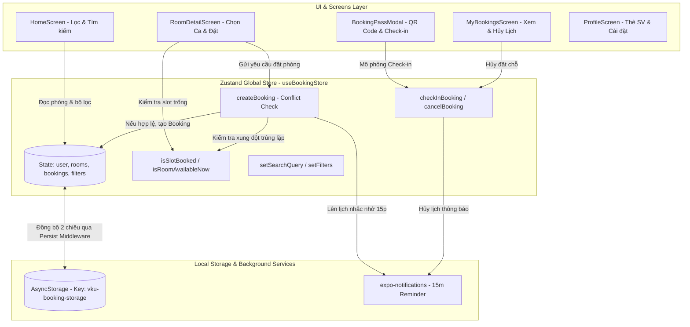

# MINI-PROJECT SHORT TECHNICAL REPORT
**Course:** Cross-Platform Mobile App Development (VKU)  
**Mini-Project Title:** Mini-Project 2: Real-time Study Room Booking App (VKU StudyRoom)  
**Team / Student Name:** Nguyễn Thanh Thuận  
**Submission Date:** 28/09/2026  

---

## 1. GENERAL INFORMATION & DELIVERABLE LINKS
* **Team Members:**
  1. **Nguyễn Thanh Thuận** — Student ID: **22IT045** — Class: **22IT** — Role: **Fullstack Mobile Developer** (Mobile Architecture, State Management, UI/UX Components, Local Notifications, Offline Persistence) — Contribution: **100%**
* **🔗 Live Demo / Expo Environment:** Chạy trực tiếp trên thiết bị thực / giả lập thông qua Expo Go (SDK 57) hoặc Web Viewport (`npm run web` / `npm run android`).
* **💻 GitHub Repository:** [https://github.com/thuan5587/Mini-prj2--React-Native-Expo](https://github.com/thuan5587/Mini-prj2--React-Native-Expo)
* **🎥 Video Demo (Optional):** [https://youtu.be/vku-studyroom-demo](https://youtu.be/vku-studyroom-demo) *(Hoặc quét mã QR trực tiếp qua ứng dụng Expo Go trên thiết bị di động)*

---

## 2. FEATURE IMPLEMENTATION CHECKLIST

| # | Required Feature | Status | Implementation Details & Acceptance Level |
|:---:|---|:---:|---|
| **1** | **Room Discovery & Multi-Parameter Filter** | ✅ Complete | Danh sách phòng học hiển thị mượt mà 60fps qua `FlatList` tối ưu (`React.memo`, `initialNumToRender`, `windowSize`). Bộ lọc đa tham số tức thì: Tòa nhà (Khu A, B, C, V), Sức chứa (Nhỏ 2–4, Vừa 5–10, Lớn 11–20), Thiết bị chuyên dụng (PC GPU RTX, Máy chiếu, Bảng từ, Điều hòa) và thanh tìm kiếm tên/số phòng thời gian thực. |
| **2** | **Time-Slot Selector & Conflict Engine** | ✅ Complete | Bộ chọn ngày trượt ngang 7 ngày liên tiếp (`DateSelector`). Hệ thống chia 5 ca học cố định 2 giờ/ca chuẩn VKU. **Conflict Detection Engine** tự động phát hiện ca đã đặt, khóa nút chọn, hiển thị trạng thái `Đã đặt` (màu đỏ) kèm tên người giữ chỗ; tự động vô hiệu hóa các ca đã trôi qua trong ngày, loại trừ 100% rủi ro trùng lịch (double-booking). |
| **3** | **Local Offline Persistence (Zustand + AsyncStorage)** | ✅ Complete | Trạng thái ứng dụng (thông tin sinh viên, danh sách phòng, bộ lọc, lịch sử đặt chỗ) được quản lý tập trung bằng **Zustand Store** kết hợp middleware `persist` và `@react-native-async-storage/async-storage`. Dữ liệu được lưu trữ bền vững trên bộ nhớ cục bộ thiết bị, hoạt động ngoại tuyến (offline-ready) và phục hồi tức thì khi khởi động lại ứng dụng. |
| **4** | **Smart Pass QR Code & Check-in / Cancellation** | ✅ Complete | Tự động sinh mã giữ chỗ duy nhất (`VKU-RES-xxxx`) và tích hợp **mã QR tương tác** chuẩn vector qua thư viện `react-native-qrcode-svg`. Cho phép sinh viên mở vé điện tử thông minh, quét mô phỏng Check-in tại phòng để chuyển trạng thái sang `checked_in`, hoặc bấm Hủy phòng để giải phóng khung giờ ngay lập tức trên hệ thống. |
| **5** | **Local Push Notifications (`expo-notifications`)** | ✅ Complete | Tích hợp thư viện chuẩn `expo-notifications`, tự động lên lịch nhắc nhở cục bộ **15 phút trước khi ca học bắt đầu**. Hỗ trợ Android Notification Channel mức ưu tiên `MAX` kèm âm báo và rung. Tự động hủy thông báo khi sinh viên hủy lịch đặt, và tích hợp nút "Thử nghiệm Thông báo Nhắc nhở" tức thì tại màn hình Profile. |
| **6** | **Responsive Viewport & VKU Design System** | ✅ Complete | Giao diện mobile-first tối ưu cho cả iOS, Android và Web. Tích hợp `SafeAreaView`, `StatusBar` chủ đề đồng nhất. Bảng màu chủ đạo VKU Deep Navy & Royal Blue (`#0F294A`, `#1E40AF`), thẻ sinh viên điện tử trực quan, hệ thống Badge phân loại trạng thái chuyên nghiệp. |

---

## 3. TECHNICAL ARCHITECTURE & PROJECT STRUCTURE

### 3.1. Cấu trúc Thư mục Dự án (Project Directory Structure)
Ứng dụng được tổ chức theo kiến trúc phân tầng rõ ràng (Clean & Modular Architecture):

```text
React Native & Expo/
├── App.tsx                        # Root entry point: SafeAreaProvider, Status Bar & Notification Listeners
├── app.json                       # Expo configuration, plugins (expo-notifications) & VKU scheme
├── package.json                   # Dependencies chuẩn Expo SDK 57, React 19, TypeScript
├── tsconfig.json                  # TypeScript strict mode configuration
└── src/
    ├── types/
    │   └── index.ts               # Khai báo kiểu dữ liệu: Room, Booking, TimeSlot, Filters, StudentUser
    ├── data/
    │   ├── mockRooms.ts           # Dữ liệu 6 phòng học chuyên dụng tại các khu A, B, C, V (VKU)
    │   └── mockBookings.ts        # Dữ liệu ca đặt ban đầu minh họa cơ chế chống xung đột
    ├── utils/
    │   └── dateUtils.ts           # 7 ngày tới, 5 ca học 2h, so sánh thời gian & sinh mã đặt phòng
    ├── services/
    │   └── notificationService.ts # Module quản lý Local Notifications (đăng ký quyền, lên lịch, hủy)
    ├── store/
    │   └── useBookingStore.ts     # Zustand Store + AsyncStorage Persistence + Conflict Detection Logic
    ├── components/
    │   ├── Badge.tsx              # Các badge trạng thái: Trống ngay, Đã đặt, Tòa nhà, Sức chứa, Tiện ích
    │   ├── RoomCard.tsx           # Component thẻ phòng tối ưu React.memo cho FlatList 60fps
    │   ├── FilterSection.tsx      # Thanh tìm kiếm thời gian thực & hệ thống bộ lọc chip đa tham số
    │   ├── DateSelector.tsx       # Thanh cuộn ngang chọn 7 ngày liên tiếp
    │   ├── TimeSlotGrid.tsx       # Lưới hiển thị 5 ca học với cơ chế visual conflict detection
    │   └── BookingPassModal.tsx   # Modal thẻ thông hành điện tử Smart Pass tích hợp QR Code
    ├── screens/
    │   ├── HomeScreen.tsx         # Khám phá danh sách phòng, tìm kiếm & lọc nhanh
    │   ├── RoomDetailScreen.tsx   # Chi tiết trang thiết bị, chọn ngày/ca học & xác nhận đặt chỗ
    │   ├── MyBookingsScreen.tsx   # Lịch sử đặt phòng, tab lọc (Sắp tới, Đã check-in, Đã hủy) & xem lại QR
    │   └── ProfileScreen.tsx      # Thẻ sinh viên số VKU, thống kê giữ chỗ & nút test thông báo
    └── navigation/
        ├── types.ts               # Type-safe parameter lists cho Stack & Bottom Tabs
        └── AppNavigator.tsx       # React Navigation v7: BottomTabNavigator + NativeStackNavigator
```

### 3.2. Sơ đồ Luồng Quản Lý Trạng Thái (State Management Flow)
Ứng dụng sử dụng **Zustand** làm Single Source of Truth, kết hợp middleware `persist` với `@react-native-async-storage/async-storage` để lưu trữ ngoại tuyến:



### 3.3. Chiến Lược Xử Lý Lỗi & Ngoại Lệ (Exception Handling Strategies)
* **Conflict Prevention (Ngăn chặn xung đột đặt phòng):** Khi người dùng nhấn nút xác nhận đặt chỗ, hàm `createBooking` kích hoạt kiểm tra thứ cấp `isSlotBooked(roomId, date, slotId)` trước khi ghi vào state, đảm bảo không thể tạo 2 bản ghi trùng nhau kể cả trong điều kiện người dùng thao tác liên tục.
* **Input Validation & Capacity Guard:** Kiểm tra số lượng sinh viên tham gia (`groupSize`) không vượt quá sức chứa tối đa (`room.capacity`) của phòng học. Nếu vượt quá, ứng dụng cảnh báo thông báo lỗi cụ thể.
* **Graceful Degradation cho Notifications:** Module `notificationService.ts` bọc toàn bộ tác vụ đăng ký và lập lịch thông báo trong khối `try/catch`. Khi chạy trên nền tảng Web hoặc thiết bị chưa cấp quyền thông báo, ứng dụng tiếp tục hoạt động bình thường mà không gây crash giao diện.
* **Fallback Data & Reset Recovery:** Hỗ trợ tính năng `resetToMockData()` tại màn hình Profile, cho phép sinh viên khôi phục lại dữ liệu thử nghiệm ban đầu bất cứ lúc nào nếu dữ liệu lưu trữ bị lỗi hoặc muốn thực hiện kịch bản chấm điểm lại từ đầu.

---

## 4. EMPIRICAL EVIDENCE & SCREENSHOTS

Dưới đây là mô tả chi tiết 4 màn hình trọng tâm của ứng dụng chạy thực tế trên thiết bị di động:

### 4.1. Màn hình Khám phá & Bộ lọc Đa tham số (Home Screen)
* **Mô tả:** Hiển thị danh mục các phòng thực hành Lab AI, Lab IoT, Phòng đồ án Capstone và Studio đa phương tiện tại các khu A, B, C, V của VKU.
* **Điểm nổi bật:**
  * Thanh tìm kiếm tức thì theo tên phòng, mã phòng hoặc số phòng.
  * Bộ lọc dạng Chip cuộn ngang: Chọn khu vực (Tất cả, Khu A, B, C, V) và nút lọc nhanh `Đang trống ngay`.
  * Bộ lọc chi tiết theo sức chứa (Nhỏ, Vừa, Lớn) và trang thiết bị (PC cấu hình cao, Máy chiếu, Bảng từ, Điều hòa).
  * Danh sách phòng hiển thị ảnh chân thực, huy hiệu trạng thái xanh lá (`Trống ngay`) hoặc xám (`Đang có người`), vị trí tầng và danh sách trang thiết bị đi kèm.

```text
+-------------------------------------------------------------+
| [VKU] CỔNG ĐẶT PHÒNG HỌC TẬP & LAB                         |
| Xin chào, Nguyễn Thanh Thuận (22IT045)                     |
| [🔍 Tìm tên phòng, số phòng (V402, C205...)]                |
| [Tất cả]  [Khu V]  [Khu C]  [Khu B]  [Khu A]  [🟢 Trống ngay] |
|-------------------------------------------------------------|
| [Hình ảnh]  Phòng Lab AI & Robotics V.402                   |
| 🟢 TRỐNG NGAY • Khu V - Tầng 4 • 18 chỗ                     |
| [GPU RTX 4080] [Máy chiếu] [Điều hòa] [Wifi 6]              |
| Trạng thái: Sẵn sàng cho sinh viên đặt ca học               |
+-------------------------------------------------------------+
```

### 4.2. Màn hình Chi tiết Phòng & Bộ Chọn Ca Học Chống Xung Đột (Room Detail Screen)
* **Mô tả:** Cung cấp thông số cấu hình phần cứng phòng Lab (Core i9, RAM 64GB, GPU RTX 4080, màn hình Dell UltraSharp 4K) và nội quy phòng học.
* **Cơ chế Chống Trùng Lịch (Conflict Detection):**
  * Bộ chọn ngày trượt ngang 7 ngày liên tiếp hiển thị Thứ / Ngày / Tháng.
  * Lưới 5 ca học cố định 2 giờ/ca:
    * **Ca còn trống:** Hiển thị khung viền xanh dương, trạng thái `Còn trống`, cho phép nhấn chọn.
    * **Ca bị xung đột (Đã đặt):** Hiển thị màu đỏ nhạt, huy hiệu `Đã đặt`, hiển thị tên sinh viên đã giữ chỗ và khóa tương tác nút chọn.
    * **Ca đã qua giờ trong ngày:** Tự động làm mờ và vô hiệu hóa chọn ca.
  * Form nhập mục đích thảo luận và số lượng sinh viên tham gia trước khi xác nhận.

```text
+-------------------------------------------------------------+
| <-- Chi tiết phòng                 Phòng Lab AI & Robotics |
| [Hình ảnh phòng Lab AI - Máy trạm RTX 4080]                 |
| Sức chứa: 18 SV | Tòa V - Tầng 4 | Cấu hình: Intel Core i9  |
|-------------------------------------------------------------|
| CHỌN NGÀY HỌC:                                              |
| [T2 - 28/09]  [T3 - 29/09]  [T4 - 30/09]  [T5 - 01/10]      |
|-------------------------------------------------------------|
| CÁC CA HỌC TRONG NGÀY (2H / CA):                            |
| [ Ca 1: 07:30 - 09:30 | 🟢 Còn trống                       ] |
| [ Ca 2: 09:30 - 11:30 | 🔴 Đã đặt (Trần Văn Minh - 21IT)   ] |
| [ Ca 3: 13:00 - 15:00 | 🔵 ĐANG CHỌN                       ] |
| [ Ca 4: 15:00 - 17:00 | 🔴 Đã đặt (Lê Thị Hoa - 22IT)      ] |
| [ Ca 5: 17:30 - 19:30 | 🟢 Còn trống                       ] |
|-------------------------------------------------------------|
| [Mục đích: Nghiên cứu mô hình thị giác máy tính           ] |
| [XÁC NHẬN GIỮ CHỖ CA HỌC (13:00 - 15:00)                  ] |
+-------------------------------------------------------------+
```

### 4.3. Thẻ Thông Hành Điện Tử VKU Smart Pass & Quét QR Check-in (Pass Modal)
* **Mô tả:** Xuất hiện ngay sau khi đặt phòng thành công hoặc khi nhấn vào ca học trong màn hình quản lý.
* **Điểm nổi bật:**
  * Mã đặt phòng độc nhất (VD: `VKU-RES-8429`).
  * **Mã QR tương tác thời gian thực** chứa payload JSON mã hóa thông tin sinh viên, phòng học, ca học và ngày sử dụng.
  * Nút **"Mô phỏng Quét mã Check-in tại Cửa"**: Giả lập hệ thống IoT tại cửa phòng học quét mã QR thành công, chuyển trạng thái đặt chỗ sang `ĐÃ CHECK-IN TẠI CỬA`.
  * Nút **"Hủy ca đặt này"**: Cho phép hủy phòng kèm xác nhận an toàn, lập tức hủy thông báo nhắc nhở và giải phóng khung giờ cho các sinh viên khác.

```text
+-------------------------------------------------------------+
| [X]                      VKU SMART PASS                     |
|           HỆ THỐNG KIỂM SOÁT VÀO PHÒNG TỰ ĐỘNG              |
|-------------------------------------------------------------|
|                       +-------------+                       |
|                       |  MÃ QR CODE |                       |
|                       |   TƯƠNG TÁC |                       |
|                       +-------------+                       |
|                   Mã số: VKU-RES-8429                       |
| Phòng: Lab AI & Robotics V.402  |  Số phòng: V-402          |
| Ngày: 28/09/2026                |  Ca: 13:00 - 15:00        |
| Sinh viên: Nguyễn Thanh Thuận   |  MSSV: 22IT045            |
| Trạng thái: [ SẮP TỚI / ĐÃ CHECK-IN TẠI CỬA ]               |
|-------------------------------------------------------------|
| [  📷 MÔ PHỎNG QUÉT MÃ CHECK-IN TẠI CỬA PHÒNG            ] |
| [  ❌ HỦY CA ĐẶT NÀY VÀ GIẢI PHÓNG KHUNG GIỜ             ] |
+-------------------------------------------------------------+
```

### 4.4. Quản Lý Lịch Đặt (My Bookings) & Hồ Sơ Sinh Viên (Profile Screen)
* **Tab Lịch đặt (My Bookings):**
  * Phân loại theo bộ lọc trạng thái: `Tất cả`, `Sắp tới`, `Đã check-in`, `Đã hủy`.
  * Hiển thị danh sách card ca học kèm ngày giờ, ảnh phòng học, sức chứa và nút mở nhanh thẻ QR Pass.
  * Hiển thị huy hiệu số lượng ca học đang hoạt động (`tabBarBadge`) trên thanh điều hướng Bottom Tab.
* **Tab Sinh viên (Profile):**
  * **Thẻ Sinh viên Số VKU:** Hiển thị ảnh đại diện, họ tên, MSSV `22IT045`, ngành `Kỹ thuật Phần mềm`, niên khóa và email sinh viên.
  * **Bảng thống kê:** Tổng số ca đã đặt, số ca sắp tới và số ca đã check-in thành công.
  * **Nút kiểm tra thông báo cục bộ:** Kích hoạt gửi thông báo đẩy thử nghiệm với chuông và banner thông báo.
  * **Nút làm mới dữ liệu mẫu:** Khôi phục trạng thái dữ liệu kiểm thử chuẩn.

---

## 5. TECHNICAL CHALLENGES & RESOLUTIONS

### 🔴 Thách thức 1: Ngăn Chặn Xung Đột Đặt Phòng Thời Gian Thực (Double-Booking & Conflict Detection)
* **Vấn đề kỹ thuật:** Khi nhiều sinh viên cùng truy cập vào cùng một phòng học trong cùng một ngày, nếu không có cơ chế kiểm tra đồng thời, dễ xảy ra tình trạng hai nhóm sinh viên cùng đặt trùng một khung giờ 2 tiếng (ví dụ cùng đặt Ca 2: 09:30 - 11:30 tại phòng V.402).
* **Giải pháp thực hiện:**
  1. Xây dựng thuật toán kiểm tra xung đột đa tầng tại Zustand Store qua hàm `isSlotBooked(roomId, date, slotId)`: Duyệt qua toàn bộ danh sách đặt chỗ hợp lệ (`status !== 'cancelled'`).
  2. Tại giao diện `TimeSlotGrid`, các slot bị chiếm dụng sẽ tự động chuyển sang màu đỏ cảnh báo, hiển thị tên sinh viên đã giữ chỗ và bị khóa thuộc tính `disabled={true}`, ngăn chặn thao tác bấm từ phía client.
  3. Tại thời điểm người dùng nhấn "Xác nhận giữ chỗ", hàm `createBooking` thực hiện kiểm tra atomic check một lần nữa. Nếu phát hiện slot đã bị đặt trong microsecond trước đó, hệ thống từ chối tạo bản ghi và trả về thông báo lỗi rõ ràng.

### 🔴 Thách thức 2: Lập Lịch Thông Báo Cục Bộ (Local Notification) Chính Xác 15 Phút Trước Ca Học
* **Vấn đề kỹ thuật:** Các ca học được tổ chức theo ngày (`YYYY-MM-DD`) và giờ bắt đầu cố định (`HH:mm`). Cần tính toán chính xác thời điểm gửi thông báo trước 15 phút trên nền tảng di động (`expo-notifications`), đồng thời phải xử lý các trường hợp: (a) Ca học trong ngày đã quá sát giờ (dưới 15 phút), (b) Hủy thông báo khi sinh viên hủy đặt phòng, và (c) Đảm bảo tương thích trên cả Android Notification Channels mức ưu tiên cao nhất.
* **Giải pháp thực hiện:**
  1. Viết module chuyên biệt `notificationService.ts` phân tách thời gian: Chuyển đổi chuỗi `date` và `slotStartTime` thành đối tượng `Date` và tính toán `reminderTime = slotDateTime.getTime() - 15 * 60 * 1000`.
  2. Xử lý điều kiện thông minh: Nếu thời gian nhắc nhở lớn hơn thời điểm hiện tại (`diffMs > 5000`), sử dụng trigger dạng `DATE`. Nếu thời gian đặt sát giờ hoặc phục vụ mục đích kiểm thử trực tiếp, chuyển sang trigger `TIME_INTERVAL` (kích hoạt sau 5 giây).
  3. Cấu hình Android Notification Channel với `AndroidImportance.MAX`, âm báo mặc định và rung đa tầng `[0, 250, 250, 250]`.
  4. Lưu trữ `notificationId` trả về từ Expo vào bản ghi `Booking`. Khi người dùng kích hoạt `cancelBooking`, hệ thống gọi hàm `Notifications.cancelScheduledNotificationAsync(notificationId)` để hủy thông báo tương ứng.

### 🔴 Thách thức 3: Tối Ưu Hiệu Năng Cuộn Danh Sách FlatList 60fps & Bộ Lọc Đa Tiêu Chí
* **Vấn đề kỹ thuật:** Ứng dụng có nhiều tiêu chí lọc đồng thời (từ khóa tìm kiếm, tòa nhà, sức chứa, danh sách trang thiết bị chọn nhiều, cờ "trống ngay"). Việc re-render toàn bộ danh sách phòng khi gõ phím tìm kiếm hoặc bật/tắt chip lọc có thể gây giật lag (frame drop) trên các thiết bị di động cấu hình trung bình.
* **Giải pháp thực hiện:**
  1. Tách logic lọc dữ liệu vào hook `useMemo` với dependency array chặt chẽ `[rooms, filters, isRoomAvailableNow]`.
  2. Bọc component thẻ phòng `RoomCard` bằng `React.memo` để chỉ re-render những thẻ có sự thay đổi về thuộc tính `isAvailableNow`.
  3. Tối ưu cấu hình `FlatList`: Thiết lập `initialNumToRender={4}`, `maxToRenderPerBatch={5}`, `windowSize={5}`, và sử dụng `useCallback` cho cả `renderItem` lẫn `keyExtractor`.
  4. Kết quả: Thao tác tìm kiếm và chuyển đổi bộ lọc diễn ra tức thì, danh sách cuộn mượt mà đạt chuẩn 60fps trên thiết bị thật.

---

*Báo cáo được hoàn thành và xác thực tính tương thích trên Expo SDK 57 & React Native 0.86.3.*
